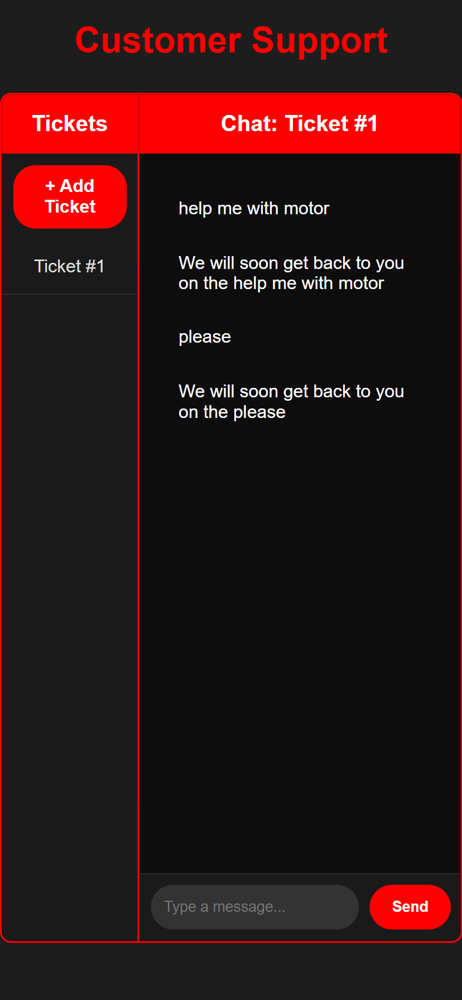
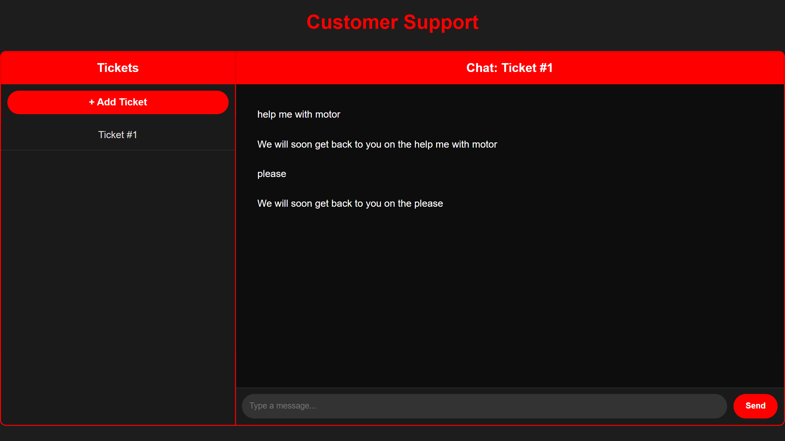
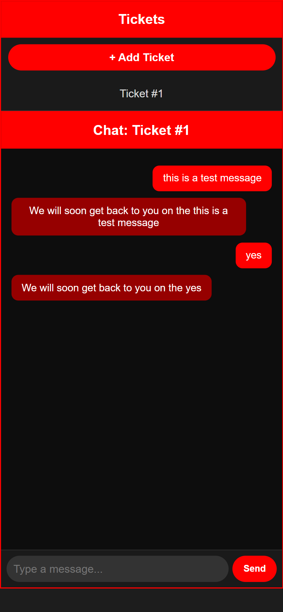
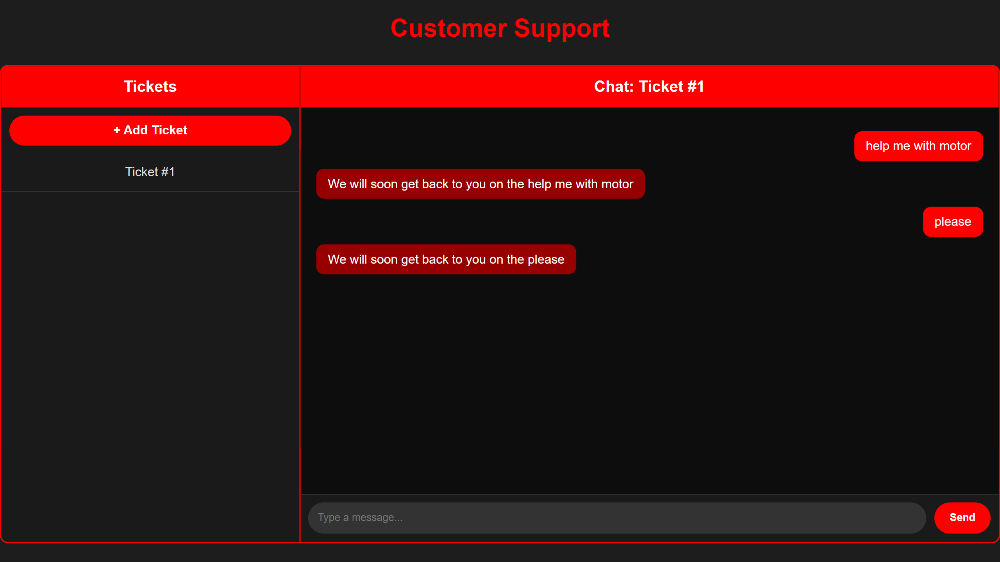
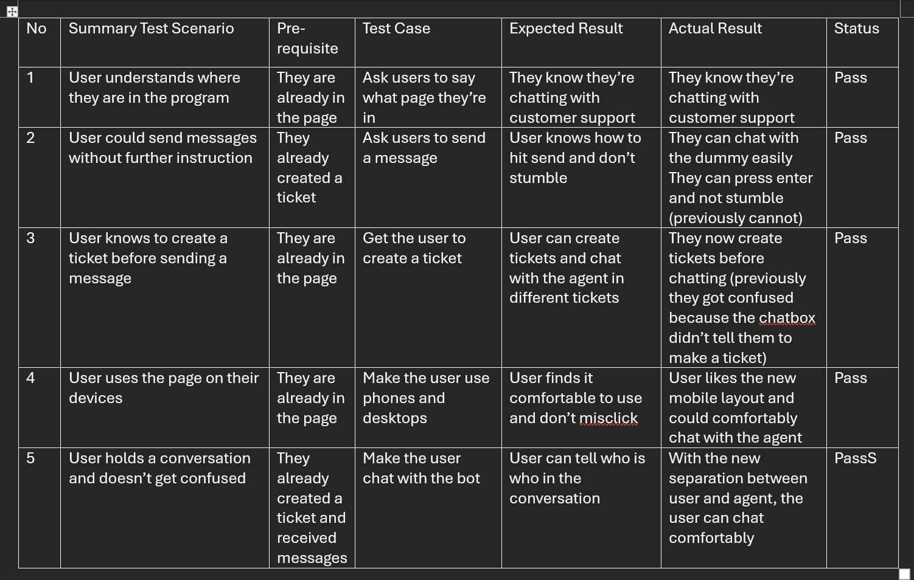

# HCI Quiz Repo
By Samuel Reagan Purnama 2902671833
- URL Link to website: [Click Here](https://dmr-uni-projects-assignments.github.io/HCI-QuizRepo/)
- URL Link to GH Repo: [Click Here](https://github.com/dmr-uni-projects-assignments/HCI-QuizRepo/tree/master)

## Original Page
The original page is a customer support chatbox.

## Modified page
To add to the design patterns:
- Navigation: Already good with header
- Input and forms: A keybind for an enter button was added. This lets people chat more easily, and not stumble when their messages won't send. 
- Feedback & status: A warning was added to ensure that the user creates and selects a ticket first. Furthermore, responses are delayed to feel more real.
- Layout & structure: Mobile responsive design was added. Previously, buttons were too small when viewed on mobile as it used the desktop page. 
- Data presentation: The chats were separated between messages and responses so the user can differentiate which is which. Previously, it was just a plain chat box without any separator / squares that looked confusing. 

## Screenshots
- Old page

- New page

## Design pattern evaluation form

